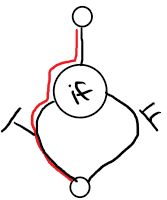
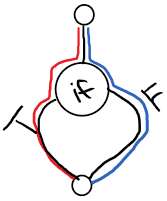
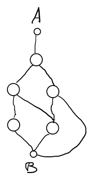
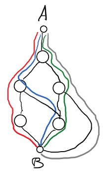

| [Module Overview](./unittest_module.md) | [What is Unit Testing](./what_is_unit_testing.md) | [Black Box](./black_box.md) | [*White Box*](./white_box.md) | [Debrief](./debrief.md) |
|-----------------|----------------------|-----------|-----------|---------|
|                 |                      |           |           |         |

### What is White Box Testing?

So _Black Box_ testing gets its name because you are supposed to imagine a black box that you cannot look into. It only makes sense that for _White Box_ testing you should imagine a white box that you...cannot...look...into...

Ok...that isn't as clear! What we _really_ mean when we say _White Box_ is that you are able to peer inside of the box and see the inner workings. Therefore, you may hear _White Box_ testing called other things: 

* Clear Box
* Open Box
* Glass Box

These all mean the same thing, but _White Box_ is perhaps the most common name.

So, as I mentioned above, the idea behind this type of testing is that it is based on the code, _not_ the specifications. It is the job of the tester to make sure all aspects of the code are tested or _covered_.

### Advantages of White Box Testing
* Based on the code so the quality of the tests can be measured objectively
* Can be used to compare test suites by measuring their quality
* Can directly test the coded behavior

### Disadvantages of White Box Testing

* Cannot discover errors due to missing paths (i.e. an unimplemented specification)
* Large software systems make it difficult to test every facet of the code (more on this below)
* Tests must be written by developers

### Coverage

Whereas Black Box testing focused on verifying that the software specifications are met, White Box testing focuses on verifying that all the code works as intended. This is done through something called _coverage_.

**Definition Time**

_Code coverage_ is the extent to which a given test suite executes the source code of the software.

#### Types of Coverage (aka Coverage Criteria)

**Statement Coverage**

This is a way of measuring the quality of a testing suite based on the amount of _statements_ the tests execute in the program. Let's look at an example from the first two tests of `mystery_func()`.

| Code                                            |
| ----                                            |
|  |

| Test | Values   |
| -    | -        |
| 1    | a=1, b=3 |
| 2    | a=5, b=9 |

Running the first test results in the following lines being executed: 1, 2, 4, 6, and 7.


Running the second test results in the following lines being executed: 1, 2, 4, 6, and 8.


Combined they cover only 6/8 of the statements, resulting in a statement coverage of 75%. This is not good enough as it is not possible to have confidence in the software if not every statement is executed. Let's see if we run the other tests in `tests.py` if we can improve the coverage.

| Test | Values   |
| -    | -        |
| 3    | a=2, b=4 |
| 4    | a=4, b=2 |

Running the third and fourth tests results in the following lines being executed: 1, 2, 4, 6, 8. There is no additional coverage provided by these two tests.

Weird! The third and fourth tests were the tests we used with Black Box testing to identify that there were faults in the code. How can they do that with the same statement coverage as the first two tests? The answer is that White Box testing doesn't care about the specification, just that as much of the program needs to be executed as possible before a test suite can be considered thorough. In this way, White Box testing compliments Black Box testing, ensuring that the test suite is more complete.

So how do we get to 100% statement coverage? All the non-executed statements are inside conditionals that aren't triggered: lines 3 and 5. By looking at the conditionals for each missed line, we can easily come up with test cases to get them to run.

**Thinking Cap Time!** 

Take a moment and ponder some values that would trigger these two conditionals: `if a*3>=b*2` and `if a>b*b`. Now go and fill in `test5` and `test6` below. If you succeed in executing these last two lines you will see confirmation printed to the console.

<iframe height="600px" width="100%" src="https://repl.it/@ericianni/whitebox1?lite=true" scrolling="no" frameborder="no" allowtransparency="true" allowfullscreen="true" sandbox="allow-forms allow-pointer-lock allow-popups allow-same-origin allow-scripts allow-modals"></iframe>

**My solutions**

In case you were curious about how I solved the problem, see below.

| Test | Code          | Values   |
| ---- | ----          | ------   |
| 5    | `if a*3>=b*2` | a=3, b=4 |
| 6    | `if a>b*b`    | a=5, b=2 |

We finally have 100% statement coverage! YAY! There is nothing more to learn about coverage! Not so fast! This section is titled Type**S** of Coverage: plural!

**Branch Coverage**

How is it possible that running every statement in a program doesn't guarantee good coverage? The answer lies in how well our tests cover the different branches in our code. _Branches_ occur anywhere in the program where a decision must be made. These decisions occur in statements that contain conditionals and we need to make sure each is tested as evaluating as either `True` or `False`.

Take a look at the source of our new `mystery_func()` below. It consists of only 4 statements and they can all be covered by the test I have provided.

<iframe height="600px" width="100%" src="https://repl.it/@ericianni/whitebox2?lite=true" scrolling="no" frameborder="no" allowtransparency="true" allowfullscreen="true" sandbox="allow-forms allow-pointer-lock allow-popups allow-same-origin allow-scripts allow-modals"></iframe>

|  |
| -                                                                |
| Branch Diagram (test1 & test2)                                   |

So how can we do better? The title of this section seems to suggest we need to think in terms of _branches_. In this small sample we have just one conditional statement `if a>1`. It is important to remember that all `if` statements have _two_ branches; our `test1` only covers the `True` branch.

**Your Turn!**

Fill in `test2` above so that the `False` branch is executed and we have 100% branch coverage. Don't worry what your test `asserts` because this is a contrived function with no specification as to the correct behavior (see disadvantages of White Box testing above), we just want to practice.

**Answer**

Here is the code I had for `test2`:

```python
def test2():
	self.assertTrue(mystery_func(1)==100)
```

|  |
| -                                                                |
| Branch Diagram (test1 & test2)                                   |

Now we have `test1` execute the `True` branch and `test2` execute the `False` branch. Now we have 100% branch coverage, but what do you notice about my solution? Does it help identify the divide by zero fault? I want to stress that just because you have a high level of coverage doesn't mean you are guaranteed to find faults. Please see some further musings in the [conclusion to this module](./debrief.md).

**Question Time**

Do you think 100% branch coverage means 100% statement coverage? Why?

**Answer Time**

100% _branch_ coverage guarantees 100% _statement_ coverage. In this way we can say branch coverage _subsumes_ statement coverage. 

**Condition Coverage**

With branch coverage we were only concerned with the `if` statement as a whole evaluated as either `True` or `False` because that is what dictates which branch is executed. With this new coverage criteria, we are concerned with _each_ condition within that `if` statement. 

_Condition_ coverage requires that we have tests that evaluate each individual condition as both `True` and `False`. If you look at the editor below, you will see the two tests I wrote before. 

<iframe height="600px" width="100%" src="https://repl.it/@ericianni/whitebox3?lite=true" scrolling="no" frameborder="no" allowtransparency="true" allowfullscreen="true" sandbox="allow-forms allow-pointer-lock allow-popups allow-same-origin allow-scripts allow-modals"></iframe>

If we create a truth table for each test, we get the following:

| Test | `a>1` | `a==0`   |
| ---- | ----- | ------   |
| 1    | T     | not eval |
| 2    | F     | F        |

Notice how we get 100% branch coverage without ever evaluating `a==0` as `False`.

In order for us to get 100% condition coverage we need to have tests that evaluate `a==0` as _both_ `True` and `False`. Given that we are dealing with an `or` we will only ever check the second condition if the first is `False` so we need to have a truth table as follows:

| `a>1` | `a==0`   |
| ----- | ------   |
| T     | not eval |
| F     | T        |
| F     | F        |

Looking at this truth table we can keep our `test1` and `test2`, but we need a new test to cover row 2.

Having a test for `a=0` will fail the first condition but evaluate as `True` for the second. Then if we use `a=1` both conditions can evaluate to `False`. Please see the editor below.

```python
def test3(self):
    self.assertTrue(mystery_func(0)==100)
```

We have now achieved 100% condition coverage! We also have 100% branch coverage! 

**Reflection Time**

Above we discussed how branch coverage _subsumes_ statement coverage. Do you think condition coverage _subsumes_ branch coverage?

**Answer Time**

While it may seem like that you can't have 100% condition coverage without 100% branch coverage, this is not the case.

Let's take a look at a different `if` statement with different conditions. Can you fashion a truth table that meets the 100% condition coverage, but not 100% branch coverage?

**Hint**

* Condition coverage only requires that each condition is evaluated as `True` and `False` at least once.

```python
def mystery_func(a,b):
	if a or b:
		print('At least one is True')
	else:
		print('At least one is False')
```

**Solution**

| a | b |
| - | - |
| T | F |
| F | T |

The above truth table would meet 100% condition coverage because both `a` and `b` are evaluated as `True` and `False`. Yet it does not meet the requirements of 100% branch coverage due to the `or` statement evaluating to `True` for both tests so we never execute the `else` branch.

Therefore we _cannot_ state that condition coverage subsumes _branch_ coverage, and furthermore it doesn't even subsume statement coverage. 

**Branch and Condition Coverage**

There is a coverage criterion called Branch and Condition coverage that is sometimes known as decision/condition coverage. This coverage attempts to have 100% branch _and_ 100% condition coverage. As you can imagine this can result in large numbers of tests to ensure that all possible combinations of branches and conditions are met. For this reason, testers often use a modified version known as _Modified Condition/Decision Coverage_ (MC/DC) coverage. You will learn about this in a later module.

But to continue our talk of subsumption, branch and condition coverage subsumes both branch coverage and condition coverage.

**Path Coverage**

Wait, there are more types of coverage?! This is the last one we will discuss. Path coverage is where the tests strive to test every _path_ through the code. A path is a unique series of branches. So, with path coverage you will likely have to traverse each branch multiple times.

**Let's see what you can do!**

Below is a flow diagram for a function. You do not need to concern yourself with what the function does or what each node does. Your task is to count the number of paths you think exist in this function between point A and B.



**How'd you do?**

The answer is there are 4 paths from A to B.



As you can probably guess, path coverage can get very complicated very quickly. This is even more evident when you attempt to do path coverage for entire programs, not just a single function. In that situation you need to cover all the paths _between_ the functions and then the paths _within_ the functions. For this reason, path coverage is not very often accomplished to high percentage rates.

### White Box Testing Wrap-up

Believe it or not there are still more types of code coverage out there, but if you can remember these you are in _very_ good shape. The most important thing to remember is that just like black box testing, white box testing has large blind spots and it is important to use them together.

Another thing to consider is that different application requirements will have different levels of coverage that are required. If you are writing a small app you probably don't need to use MC/DC, but if you are designing software for a 787 Dreamliner you will absolutely need to use it.

Please proceed to the next section for a [Unit Test Debrief](./debrief.md)
