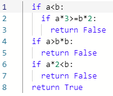
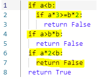
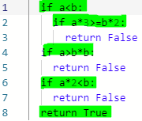

| [Module Overview](./unittest_module.md) | [What is Unit Testing](./what_is_unit_testing.md) | [Black Box](./black_box.md) | [*White Box*](./white_box.md) | [Debrief](./debrief.md) |
|-----------------|----------------------|-----------|-----------|---------|
|                 |                      |           |           |         |

### What is White Box Testing?

So _Black Box_ testing get's its name because you are supposed to imagine a black box that you cannot look into. It only make sense that for _White Box_ testing you should imagine a white box that you...cannot...look...into...

Ok...that isn't as clear! What we _really_ mean when we say _White Box_ is that you are able to peer inside of the box and see the inner workings. This is why you may hear _White Box_ testing called other things: 

* Clear Box
* Open Box
* Glass Box

These all mean the same thing, but _White Box_ is perhaps the most common name.

So as I mentioned above, the idea behind this type of testing is that it is based on the code, _not_ the specifications. It is the job of the tester to make sure all aspects of the code are tested or _covered_.

### Advantages of White Box Testing

* Based on the code so the quality of the tests can be measured objectively
* Can be used to compare test suites by measuring their quality
* Can directly test the coded behavior

### Disadvantages of White Box Testing

* Cannot discover errors due to missing paths (i.e. an unimplemented specification)
* Large software systems make it difficult to test every facet of the code (more on this below)
* Tests must be written by developers

### Coverage

Where as Black Box testing focused on verifying that the software specifications are met, White Box testing focuses on verifying that all the code works as intended. This is done through something called _coverage_.

**Definition Time**

_Code coverage_ is the extent to which a given test suite exectutes the source code of the software.

#### Types of Coverage

**Statement Coverage**

This is a way of measuring the quality of a testing suite based on the amount of _statements_ the tests execute in the program. Let's look at an example from the first two tests of `mystery_func()`.

| Code                                            |
| ----                                            |
|  |

| Test | Values   |
| -    | -        |
| 1    | a=1, b=3 |
| 3    | a=5, b=9 |

Running the first test results in the following lines being executed: 1, 2, 4, 6, and 7.

Running the second test results in the following lines being executed: 1, 2, 4, 6, and 8.

Combined they cover only 6/8 of the statements, resulting in a statement coverage of 75%. This is not good enough as it is not possible to have confidence in the software if not every statement is executed. Let's see if we run the other tests in `tests.py` if we can improve the coverage.

| Test | Values   |
| -    | -        |
| 3    | a=2, b=4 |
| 4    | a=4, b=2 |

Running the third and fourth tests results in the following lines being executed: 1, 2, 4, 6, 8. There is no additional coverage provided by these two tests.

Weird! The third and fourth tests were the tests we used with Black Box testing to identify that there were faults in the code. How can they do that with the same statement coverage as the first two tests? The answer is that White Box testing doesn't care about the specification, just that as much of the program needs to be executed as possible before a test suite can be considered thorough. In this way, White Box testing compliments Black Box testing, ensuring that the test suite is more complete.

So how do we get to 100% statement coverage? All the non-executed statements are inside conditionals that aren't triggered: lines 3 and 5. By looking at the conditionals for each missed line, we can fairly easily come up with test cases to get them to run.

**Thinking Cap Time!** 

Take a moment and ponder some values that would trigger these two conditionals: `if a*3>=b*2` and `if a>b*b`. Now go and fill in `test5` and `test6` below. If you succeed in executing these last two lines you will see confirmation printed to the console.

<iframe height="600px" width="100%" src="https://repl.it/@ericianni/whitebox1?lite=true" scrolling="no" frameborder="no" allowtransparency="true" allowfullscreen="true" sandbox="allow-forms allow-pointer-lock allow-popups allow-same-origin allow-scripts allow-modals"></iframe>

**My solutions**

In case you were curious about how I solved the problem, see below.

| Test | Code          | Values   |
| ---- | ----          | ------   |
| 5    | `if a*3>=b*2` | a=3, b=4 |
| 6    | `if a>b*b`    | a=5, b=2 |

We finally have 100% statement coverage! YAY! There is nothing more to learn about coverage! Not so fast! This section is titled Type**S** of Coverage: plural!

**Branch Coverage**

<iframe height="600px" width="100%" src="https://repl.it/@ericianni/whitebox2?lite=true" scrolling="no" frameborder="no" allowtransparency="true" allowfullscreen="true" sandbox="allow-forms allow-pointer-lock allow-popups allow-same-origin allow-scripts allow-modals"></iframe>

**Conditional Coverage**

**Path Coverage**

